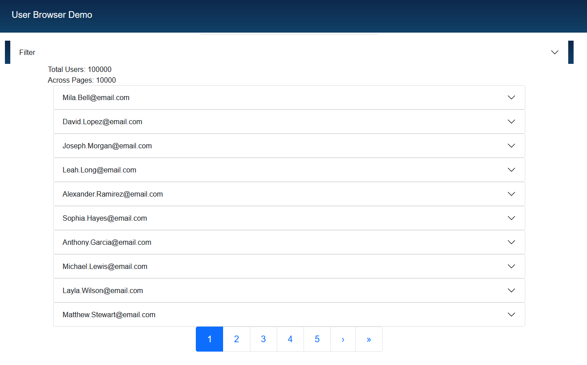

  <h1>User Browser</h1>
  
  

  User Metadata Management Web Application
  

# Table of Contents

- [About the Project](#about-the-project)
- [Tech Stack](#tech-stack)
- [Features](#features)
- [Usage](#usage)

## About the Project

This project provides interactive identity and access management (IAM) services through a web interface. It was originally created as a proof-of-concept for integration with Microsoft Azure Entra ID. User Browser leverages React Hooks for front-end state management and aims to provide performant and secure CRUD operations in a simple UI.

### Tech Stack

### Features

- **SAML Authentication**: Any SAML-capable identity provider can be used to grant secure access to the application.
- **Pagination and "big data" support**: Quickly search through _many_ records to find the ones you're looking for.

### Usage 
This project is packaged using `docker-compose`. A few minor modifications to the `compose.yml` are required prior to running it:

* Create a SAML Identity Provider configuration in your IDP of choice. This has been tested using Azure Entra ID and Atlassian Crowd, but any provider should work. Specifically, set:

* * `Entity ID` to some value. This will be used as the IDP_ISSUER below.
* * `Assertion Consumer Service URL` to `http://localhost:8080/saml/consume`

* Copy the `Identity provider single sign-on URL` value for use below as the IDP_LOGIN_URL.

* Copy the `certificate` value, remove all line endings and the ===BEGIN=== and ===END=== tags. This will be used as the IDP_CERT below.

* Update `compose.yml` to specify the following env variable values if not already set:

`NODE_APP_SUB_FRONTEND_URL` to "http://localhost"

`NODE_APP_SUB_BACKEND_URL` to "http://localhost:8080"

`NODE_APP_SUB_INSECURE_COOKIES` to "true". This setting should be "false" if deploying using SSL.

`NODE_APP_SUB_IDP_LOGIN_URL` to the `Identity provider single sign-on URL` copied above.

`NODE_APP_SUB_IDP_LOGOUT_URL` the logout URL noted in the IDP configuration.

`NODE_APP_SUB_CREATE_DATA` to "yes" to create fake/synthetic data for testing purposes, or "no" to not create data.

`NODE_APP_SUB_IDP_ISSUER` to the Entity ID specified above.

`NODE_APP_SUB_IDP_CERT` to the certificate value specified above.

* Run the application components in Compose: `docker compose up`

* (Optional): Add synthetic test data by querying `http://localhost:8080/api/initTestData`
